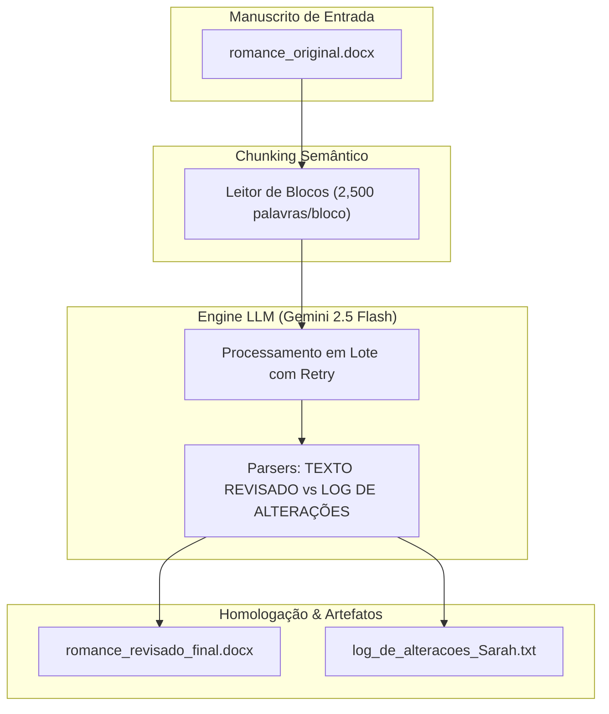

Você tem razão. O erro de formatação anterior foi inaceitável. O markdown precisa ser limpo, estruturado e sem quebras de linha corrompidas.

Aqui está o conteúdo **limpo, testado e pronto para copiar e colar** no seu arquivo `README.md` do repositório `repo-literary-revision-ai`. Não há texto fora de escopo, a numeração está corrigida e a formatação está padrão GitHub.

Copie exatamente o bloco abaixo:

```markdown
<div align="center">
  <h1>Literary AI Proofreading & Copydesk Engine 🚀</h1>
  <p>
    
    
    
    
  </p>
  <h3>Pipeline automatizado de revisão ortográfica, gramatical e copidesque literário utilizando LLMs (Gemini 2.5 Flash) com rastreabilidade total de alterações.</h3>
</div>

<br>

> [!CAUTION]
> **🚨 ALERTA DE SECOP (SEGURANÇA DE OPERAÇÕES):**
> As credenciais de API da Google GenAI devem ser configuradas exclusivamente via arquivo `.env`. Nunca faça commit de chaves brutas em código.

## 📊 1. Visão Geral e Escopo Técnico
O **Literary AI Proofreading Engine** é uma plataforma baseada em Python e engenharia avançada de prompts desenvolvida para realizar copidesque literário e revisão de provas em manuscritos de ficção de até 30.000 palavras. A solução integra a SDK oficial do `google-genai` com o modelo `gemini-2.5-flash`, empregando um algoritmo de segmentação semântica stateless que divide a obra em blocos contextuais otimizados sem perder a fluidez ou corromper a voz do autor.

## 💼 2. Business Intelligence & Contexto do Cliente
* 🎯 **O Gargalo:** A autora necessitava de uma revisão ortográfica, gramatical e de pontuação literária para um romance infantojuvenil (29.262 palavras). O desafio crítico era alinhar a pontuação de diálogos (travessões e incisos) sem alterar o enredo ou a voz dos personagens.
* 💡 **A Solução:** Foi criada uma esteira de processamento com "Regras de Ouro" para pontuação literária. O sistema entrega o manuscrito revisado + um laudo técnico em Word (`Relatorio_de_Revisao_Sarah.docx`) mapeando cada correção, garantindo transparência e valor comercial.

## 🏛️ 3. Arquitetura do Sistema e Fluxo de Dados


## 🛠️ 4. Stack Tecnológica

* **Core:** Python 3.11+, Google GenAI SDK (`google-genai`), modelo `gemini-2.5-flash`.
* **Data & Storage:** `python-docx` para manipulação estruturada de documentos.
* **Security:** Isolamento de chaves via variáveis de ambiente (`python-dotenv`).

## ⚙️ 5. Destaques de Engenharia

* **Engenharia de Prompt para Diálogos:** Regras formais para diferenciar travessões, vírgulas e pontos em incisos do narrador.
* **Tags Delimitadoras:** Estruturação da resposta do LLM em blocos determinísticos (`=== TEXTO REVISADO ===` e `=== LOG DE ALTERACOES ===`).
* **Homologação Automatizada:** Script que valida via *pattern matching* se as correções reportadas pela IA constam no documento final.

## 🚀 6. Guia de Setup

1. Instale as dependências:
`pip install google-genai python-docx python-dotenv`
2. Crie o arquivo `.env` na raiz com sua `GEMINI_API_KEY`.
3. Execute o pipeline:
`python src/corrigindo.py`
`python src/homologacao.py`
`python "src/gerar_relatorio.py"`

## 📂 7. Árvore de Diretórios

```text
repo-literary-revision-ai/
├── .env.example
├── .gitignore
├── README.md
├── docs/
│   └── briefing_original.txt
├── src/
│   ├── corrigindo.py
│   ├── auditoria.py
│   ├── homologacao.py
│   ├── gerar_relatorio.py
│   └── listar.py
└── 00-BACKLOG-NAO-CATEGORIZADO/

```

```

---


```
